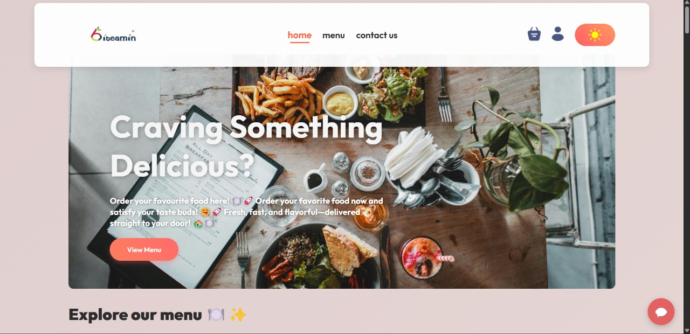
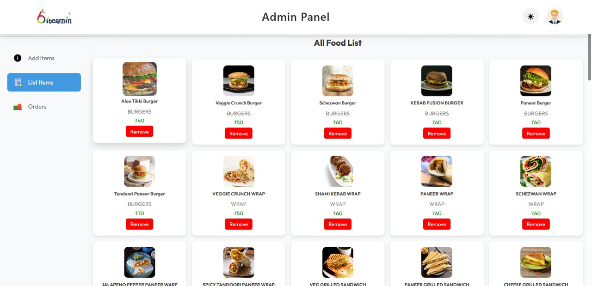
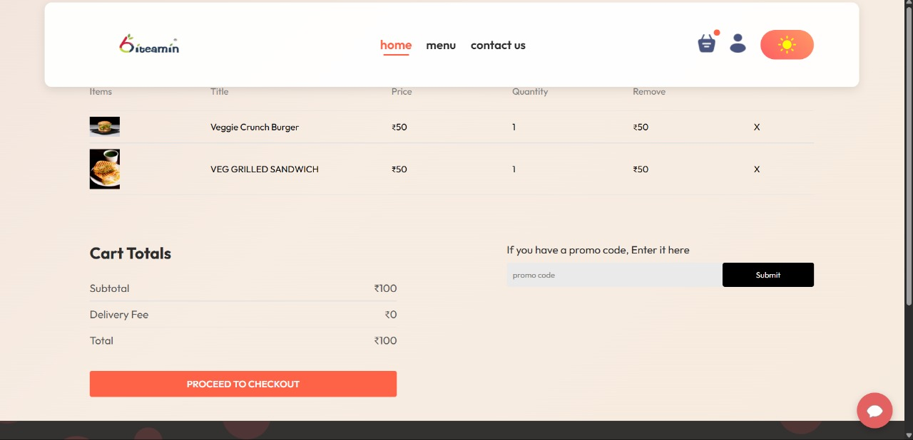
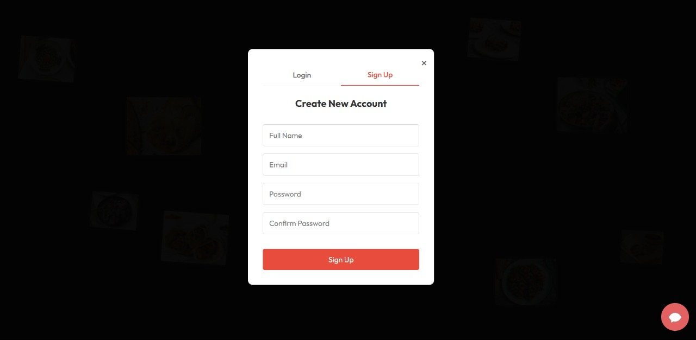
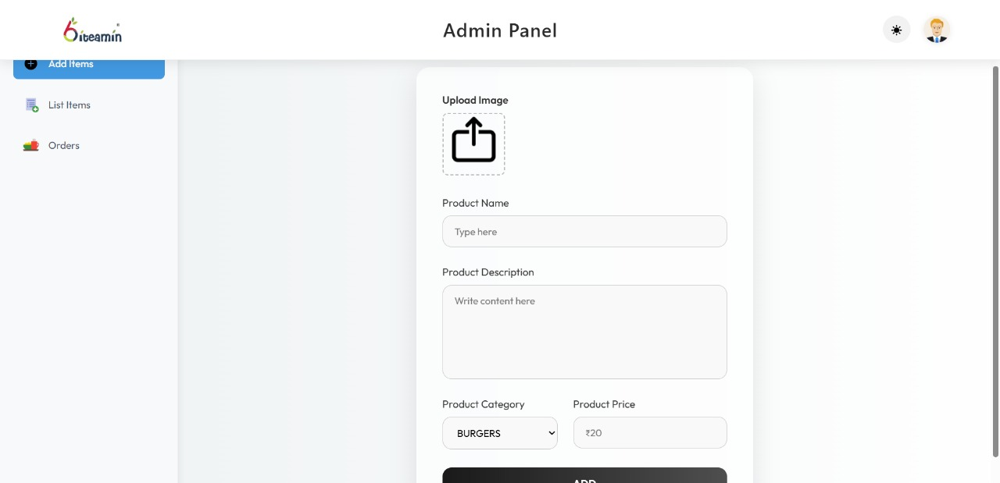

# Food Ordering System – By *Aditya Vatnani*, *Aditya Gupta*, *Aryan Awasthi*, *Ansh Kushwaha*

---

## Overview

This repository contains the complete implementation of our **Food Ordering System Project**, built collaboratively as part of our BCA Major Project.

It includes:

-  **Frontend** – User UI & ordering experience  
-  **Backend** – APIs, authentication & database  
-  **Admin Panel** – Food, order & user management  

Together, they form a fully functional and scalable Food Ordering application.

The purpose of this repository is to demonstrate our understanding of the **MERN Stack**, including:

- React component-based UI development  
- Express & Node.js backend development  
- MongoDB database modeling  
- REST API architecture  
- State management, routing & authentication  
- Admin-driven CRUD operations  
- Full-stack project structuring & deployment readiness

---

## Tech Stack

- React.js
- Tailwind/Bootstrap
- Node.js
- Express.js
- JWT
- bcrypt
- MongoDB
- Mongoose

---

## Project Structure

Food-Ordering-System/
├── backend/
├── frontend/
└── admin/

##  Screenshots

### User Frontend UI

### 📱 Food Menu Page

### 🛒 Cart Page

### 🔐 Authentication Screens

### 🛠️ Admin Panel Dashboard

---

## Learning Outcomes

Throughout this project, we gained hands-on experience in:
- Building production-like MERN apps
- Structuring monorepos for full-stack projects
- Securing applications with JWT
- Handling databases & CRUD operations
- Implementing responsive UI designs
- Working collaboratively using Git & GitHub

## Team Members

- Aditya Vatnani
- Aditya Gupta
- Aryan Awasthi
- Ansh Kushwaha

## Acknowledgment

**Thanks to mentors, instructors & documentation resources that guided our learning journey!**
